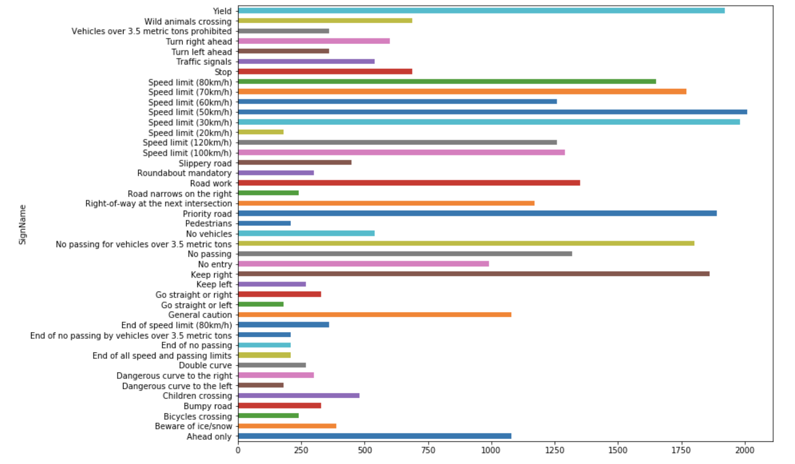
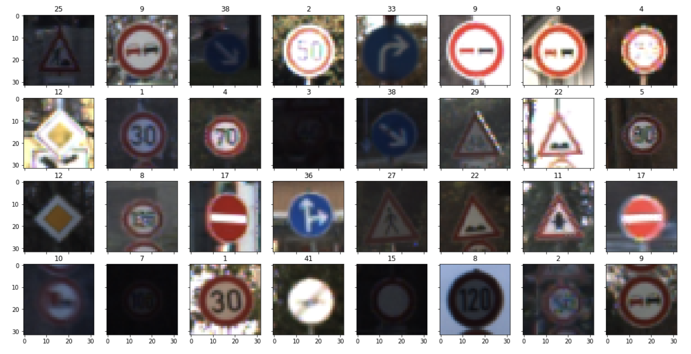
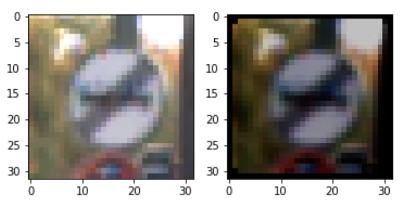
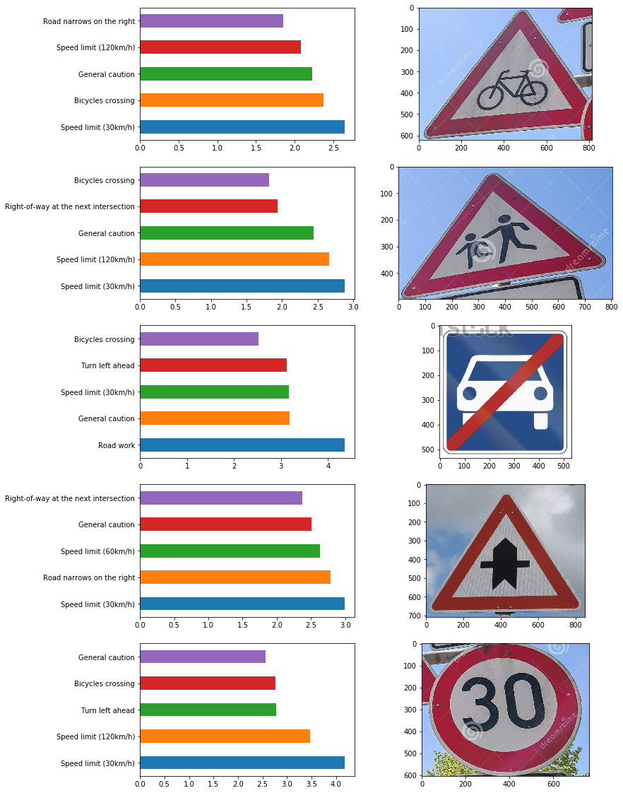

# Project Write-up

## 1. Data Set Summary & Exploration
The dataset comprises of:
- Number of training examples = 34799
- Number of validation examples = 4410
- Number of testing examples = 12630
- Image data shape = (32, 32, 3)
- Number of classes = 43

The **distribution of classes** is quite uneven, as seen in the barchart below. This will likely affect the training process, and the performance of the model on some under-represented classes.



The images also appear to be taken **under a wide array of conditions, such as different brightness levels and angles**: This will make the training process more difficult, but will make the model more generalizable at the end.



## 2. Design and Test a Model Architecture

### a) Preprocessing

In general, I only did **normalization** (i.e. subtract by 128 and divide by 128). I decided to keep the image in **3 channels (RGB)** as I felt that some of the color data of the stop sign might be helpful.

However, I also experimented with tweaking the image through a combination of brightness, contrast and rotation edits:

```python
def tweak(x):
    x = tf.image.random_brightness(x, 0.3) # max_delta
    x = tf.image.random_contrast(x, 0.8, 1.2)
    return x

def rotate(x):
    x = ndimage.rotate(x, np.random.randint(-20, 20))
    x = resize(x)
    return x
    
def normalize(x):
    x = np.subtract(x, [128]) / 128
    return x
```

An example of an image with `tweak` and `rotate` applied is shown on the RHS below.


### b) Final model architecture
| Layer | Description |
|------|-----------|
| Input | 32x32x3 RGB image |
| Convolution 4x4 | 1x1 stride, valid padding => 29x29x64 |
| Convolution 2x2 | 1x1 stride, valid padding => 28x28x64 |
| Max Pooling | 2x2 stride, valid padding => 14x14x64 |
| Convolution 2x2 | 1x1 stride, valid padding => 12x12x32 |
| Max Pooling | 2x2 stride, valid padding => 6x6x32 |
| Flatten | 1152 |
| Fully connected | 512 |
| Fully connected/logits | 42 classes |

### c) Training parameters
| Component | Value | Description/Details |
|-----------|-------|------------|
| Loss | **Cross Entropy Loss** | Cross-entropy loss is often a good choice for multi-label classification problems. |
| Loss operation | **Reduce mean** | Reducing the mean loss is reliable metric |
| Optimizer | **Adam Optimizer** | I stayed with Adam optimizer as I felt it was good enough for this use case and did not run into any issues with it. |
| Learning rate | **0.005** | I chose a smaller learning rate, as the model started off performing quite well (~0.9) and I wanted to tune it slowly upwards, and avoid big steps that would cause the validation to oscillate.|
| Batch size | **128** | Since we have a lot of training data, a bigger batch size is possible. However, we also want to balance this with memory considerations, hence 128 is a good compromise. |
| Epochs | **50** | 50 epochs is more than enough to train the network, as it is not very deep. | 

### d) Model Results

| Set | Accuracy |
|----|---------|
| Train | 0.977 |
| Validation | 0.961 |
| Test | 0.900 |

### e) Lessons learnt from training process

- At first, I kept quite close to LeNet and tried **increasing the number of nodes in the FC layers**. However, this didn't get the performance past 0.9
- Since I was dealing with **color/3-channel data**, I decided to 
  - i) increase number of convolutional layers;
  - ii) decrease the kernel size (to retain more data, since the image was quite small)
  - iii) use max-pooling selectively, to prevent losing too much data too early
- At this point, the model was performing around ~0.9, but still struggling
- Finally, I decided to increase the **number of nodes in the FC layers** and **remove one layer as well**, since the number of classes we had was also much higher (43) compared to the initial leNet example.
- I did not do much tuning to the training parameters, other than decreasing the learning rate from `0.01` to `0.005` when I noticed that this new model architecure resulted in a much higher validation accuracy from the get-go.
- In general, within ~30 epochs or so, I could tell if a model architecture was going to be successful or not (tended to oscillate and get stuck). So keeping to 50 epochs for the final iteration was more than enough.


### f) Possible areas for improvement
This problem felt self-contained and straightforward enough, and the input images were small enough, that I did not try some of the other more current methods of architecting the network. However, future work could look at exploring features like:
- ReLu / Max relu / activation functions
- Dropout


## 3. Testing on new images

The image below depicts the 5 test images, as well as the breakdown of the top 5 predicted probabilities. My overall accuracy was **much lower at  `0.2` compared to the test set accuracy of `0.9`** (section 3d). There may be a couple of reasons for this:

- **Quality / clarity of the image** is much different from that in the given dataset: These are often much crisper and cleaner, with much more vibrant colors. In general, images in the dataset tended to be quite blurry and also de-saturated. This is especially so for the `No Vehicles` image
- Some of these classes **occur less often in the training dataset**, especially the `Bicycles crossing` and `Children crossing` ones. Conversely, the `30km/h` is relatively heavily represented in the training dataset, and also the only correct prediction.
- In general, there's **not much distinction in the predicted probabilities** - the model seems to be having difficult making clear and confident predictions. However, we do notice that the right label sometimes appear in the other 4 predictions, such as for `Bicycles crossing`




## 4. Relevant links

http://www.fast.ai/

http://yerevann.com/a-guide-to-deep-learning/

https://medium.com/@vivek.yadav/dealing-with-unbalanced-data-generating-additional-data-by-jittering-the-original-image-7497fe2119c3#.obfuq3zde

https://medium.com/@vivek.yadav/improved-performance-of-deep-learning-neural-network-models-on-traffic-sign-classification-using-6355346da2dc#.tq0uk9oxy

Batch size discussion ::

http://stats.stackexchange.com/questions/140811/how-large-should-the-batch-size-be-for-stochastic-gradient-descent

Adam optimizer discussion::

http://sebastianruder.com/optimizing-gradient-descent/index.html#adam'

Dropouts ::

https://pgaleone.eu/deep-learning/regularization/2017/01/10/anaysis-of-dropout/

